## An access control system reference

This is a quick reference you can use to identify what access control system someone is using simply by looking at a reader.
Keep in mind this reference is user contributed, so information may be missing in the majority of cases. If you could contribute on GitHub, it would be appreciated.

### Readers

Image                                                                              | Details                                   | Card Types                                                                                        | Countries    | Further Information
---------------------------------------------------------------------------------- | ----------------------------------------- | ------------------------------------------------------------------------------------------------- | ------------ | -------------------
&nbsp;                   | [HID Global](https://www.hidglobal.com/)   [HID® Proximity ProxPoint® Plus 6005](https://www.hidglobal.com/products/readers/hid-proximity/6005)  | 125 kHz - [HID Proximity](https://www.hidglobal.com/products/cards-and-credentials/hid-proximity) | NZ AU           | [Proxmark Commands for HID Proximity](https://github.com/Proxmark/proxmark3/wiki/commands#lf-hid)  Often contains a small branding strip replacing the HID branding in the center of the reader
&nbsp; 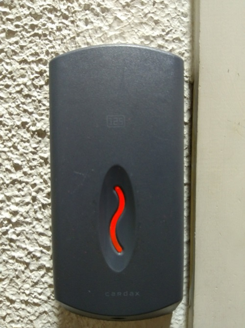 | [Cardax (Now Gallagher)](https://security.gallagher.com/)  [Cardax Prox Reader](assets/Cardax - Product List April 03.pdf) | 125 kHz - [HID Proximity](https://www.hidglobal.com/products/cards-and-credentials/hid-proximity) | NZ AU | [Proxmark Commands for HID Proximity](https://github.com/Proxmark/proxmark3/wiki/commands#lf-hid)   Information and high resolution product images are hard to find post the rebranding to Gallagher.  Branded with "Cardax" and "125"
&nbsp; 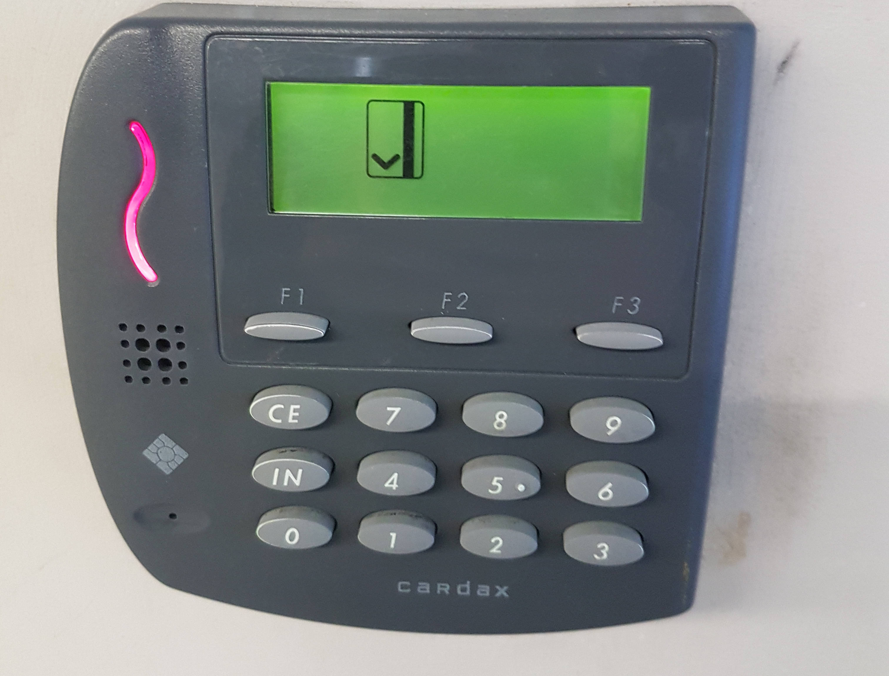 | [Cardax (Now Gallagher)](https://security.gallagher.com/)  [Cardax Prox Mifare Reader](assets/Cardax - Product List April 03.pdf) | 125 kHz and 13.56 MHz | NZ |   Information and high resolution product images are hard to find post the rebranding to Gallagher.
&nbsp; 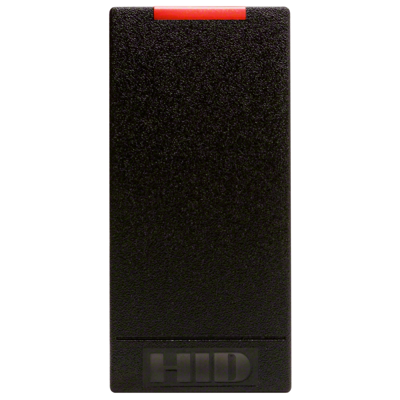 | [HID Global](https://www.hidglobal.com/)   [HID® iCLASS® RW100 Reader/Writer 6101](https://www.hidglobal.com/products/readers/iclass/rw100) | 13.56 MHz - [HID iClass](https://www.hidglobal.com/products/cards-and-credentials/iclass)   System may include backwards compatibility for MIFARE (classic or DESFire) or HID Proximity | NZ AU     | Very similar appearance to HID iClass SE   [Proxmark Commands for HID iClass](https://github.com/Proxmark/proxmark3/wiki/commands#hf-iclass)   [HID iClass global key](https://ss23.github.io/hid-iclass-key/)
&nbsp; 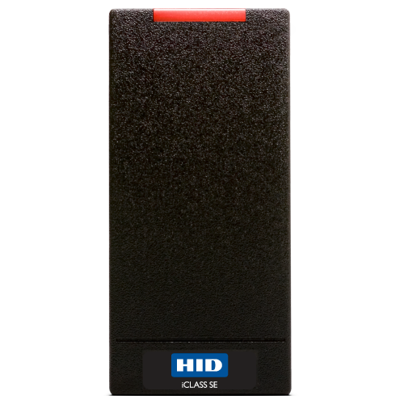 | [HID Global](https://www.hidglobal.com/)   [HID® iCLASS SE® R10](https://www.hidglobal.com/products/readers/iclass-se/r10) | 13.56 MHz - [HID iClass](https://www.hidglobal.com/products/cards-and-credentials/iclass)   [HID iClass SE](https://www.hidglobal.com/products/readers/iclass-se)   May contain backwards compatibility for MIFARE (classic or DESFire) or HID Proximity | NZ AU    | Very similar appearance to HID iClass standard. May contain additional branding of "SE"  [Proxmark Commands for HID iClass](https://github.com/Proxmark/proxmark3/wiki/commands#hf-iclass)
&nbsp; 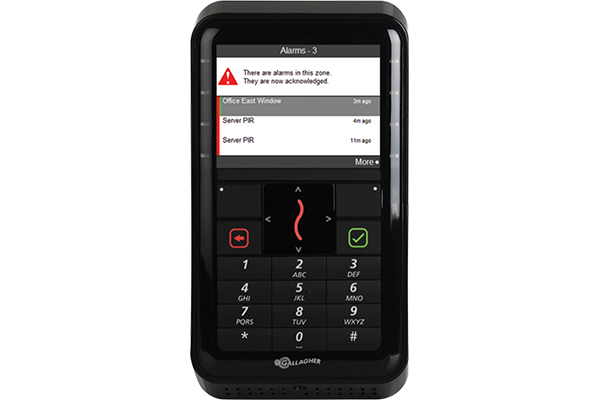 | [Gallagher Security](https://security.gallagher.com/)  [T20 - T-Series Readers](https://security.gallagher.com/products/t-series-readers) | 13.56 Mhz - MIFARE DESFire EV1, MIFARE DESFire EV2, MIFARE Plus and MIFARE Classic 125 kHZ - [HID Proximity](https://www.hidglobal.com/products/cards-and-credentials/hid-proximity)   Bluetooth | NZ AU | May be used as an alarm terminal only, or access control and an alarm system   Many options may be disabled or enabled based on backwards compatibility and security requirements  [Gallagher T-Series Information PDF](https://security.gallagher.com/assets/2523/T-Series_Reader_Datasheet.pdf)
&nbsp; 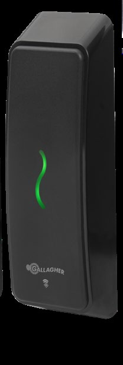 | [Gallagher Security](https://security.gallagher.com/)  [T15 - T-Series Readers](https://security.gallagher.com/products/t-series-readers) | Identical to T20 | NZ AU | Identical to T20 in most aspects except alarm functionality
&nbsp; 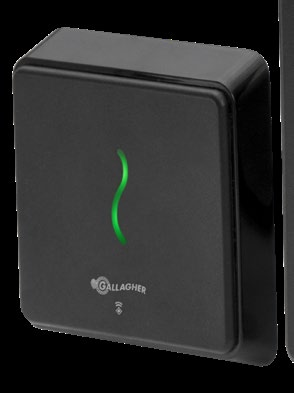 | [Gallagher Security](https://security.gallagher.com/)  [T12 - T-Series Readers](https://security.gallagher.com/products/t-series-readers) | Identical to T20 | NZ AU | Identical to T20 in most aspects except alarm functionality
&nbsp; 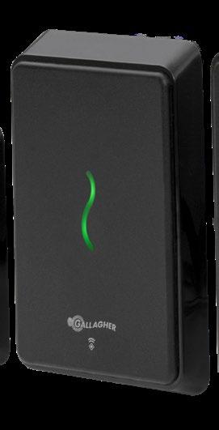 | [Gallagher Security](https://security.gallagher.com/)  [T11 - T-Series Readers](https://security.gallagher.com/products/t-series-readers) | Identical to T20 | NZ AU | Identical to T20 in most aspects except alarm functionality
&nbsp; 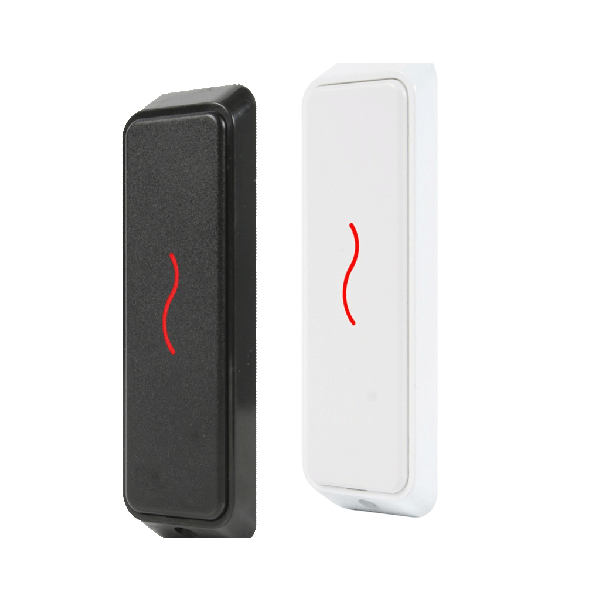 | [Gallagher Security](https://security.gallagher.com/)  [T10 - T-Series Readers](https://security.gallagher.com/products/t-series-readers) | Identical to T20 | NZ AU | Identical to T20 in most aspects except alarm functionality
&nbsp; 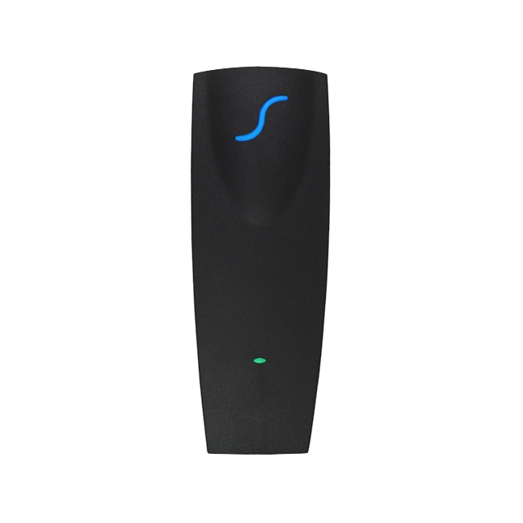 | [Paradox](http://www.paradox.com/)  [R910 (formerly DGP-R910)](http://www.paradox.com/Products/default.asp?CATID=7&SUBCATID=73&PRD=243) | 125 kHZ - Paradox | NZ | [Proxmark Commands for Paradox](https://github.com/Proxmark/proxmark3/wiki/commands#lf-paradox)
&nbsp; 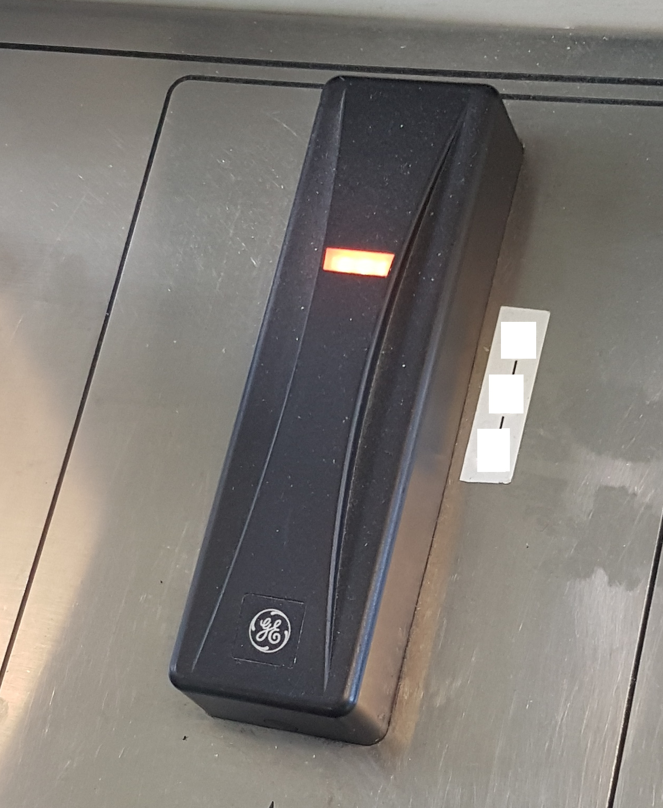 | GE (General Electric) | Unknown | AU | 
&nbsp; 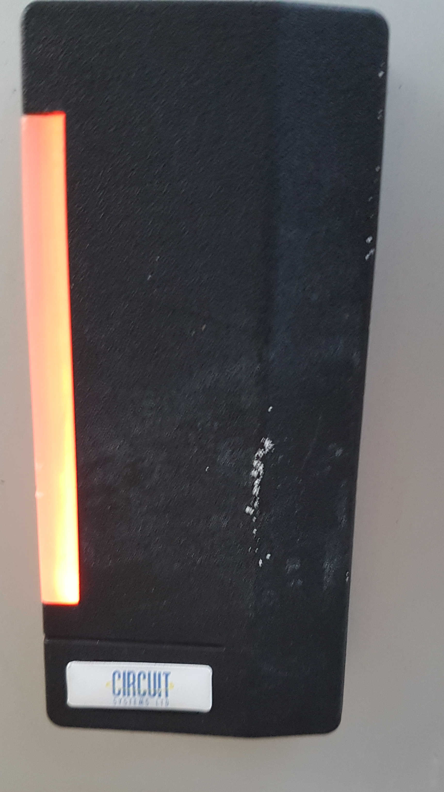 | Unknown | Unknown | NZ | 
&nbsp; 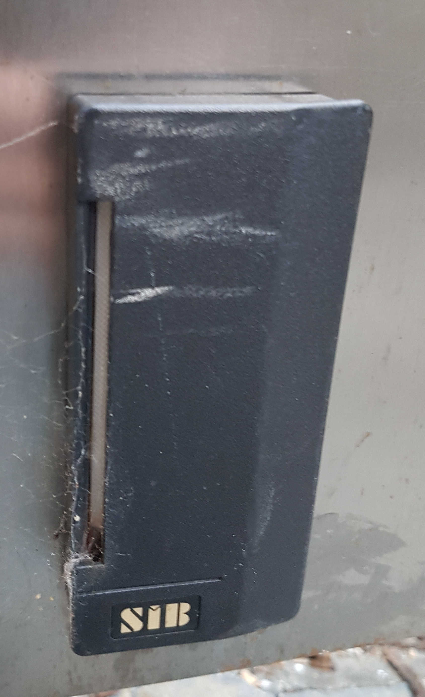 | Unknown | Unknown | NZ | 
&nbsp; 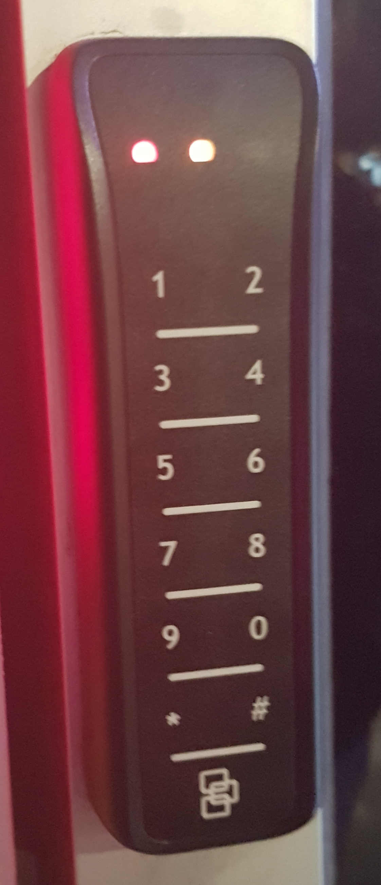 | Unknown | Unknown | AU | 
&nbsp; 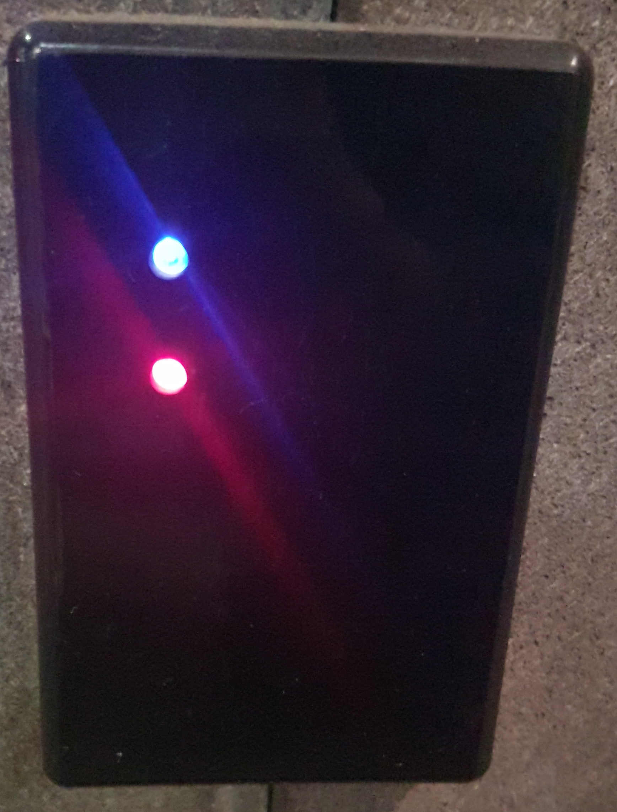 | Unknown | Unknown | AU | 
&nbsp; 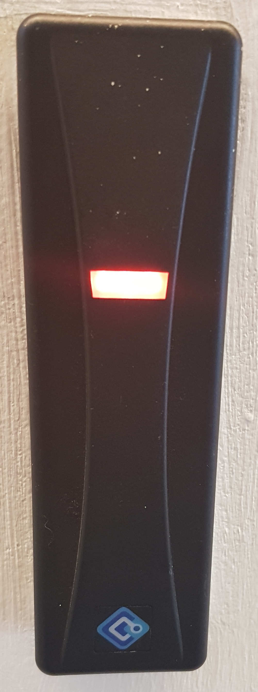 | Unknown | Unknown | TW | 
&nbsp; 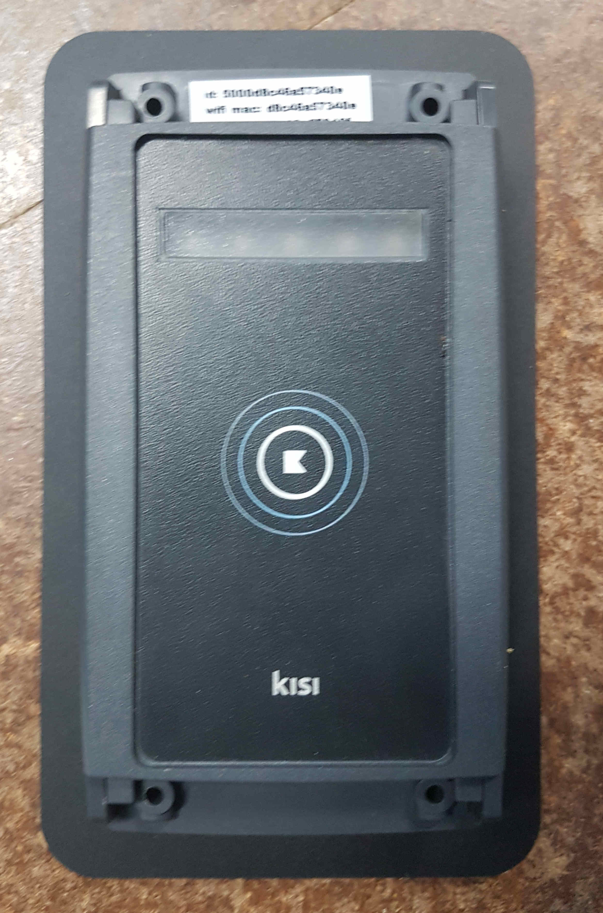 | Unknown | Unknown | TW | 
&nbsp; 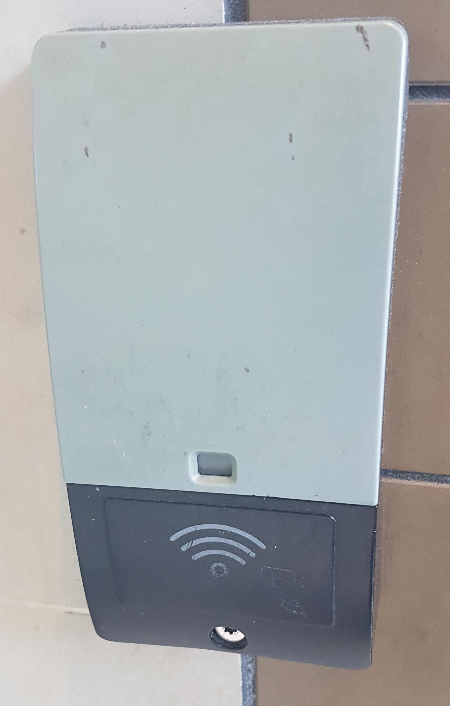 | Unknown | Unknown | NZ | 
&nbsp; 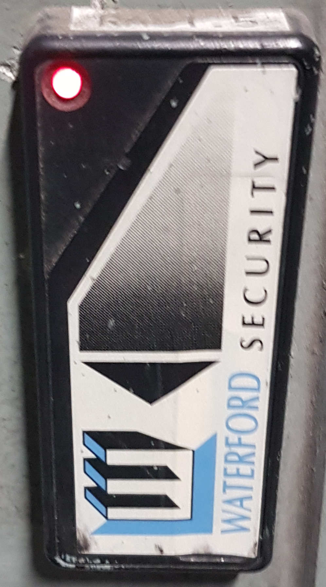 | Waterford | Unknown | NZ | 

### Contributing

Any contributions, especially making the front-end nicer or information on access control systems in your country, are much appreciated. Please send a pull request on GitHub and the website will be updated automatically when the information is merged.
